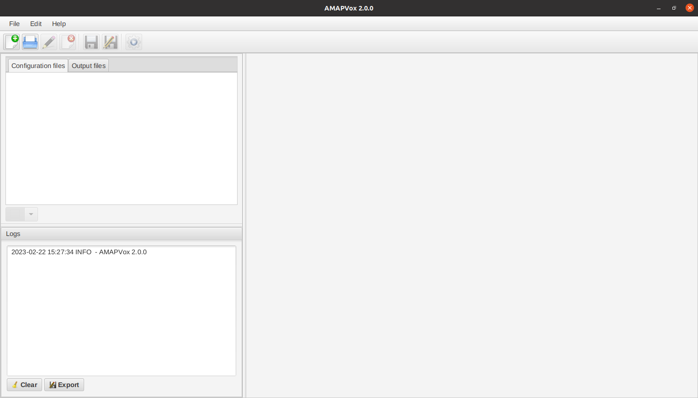

```{r, include = FALSE}
knitr::opts_chunk$set(
  collapse = TRUE,
  comment = "#>"
)
```

<!-- AMAPVox logo -->
{width=256px}

AMAPVox is an R package that embeds a Java Desktop Application. The Java part
of AMAPVox is distributed as a set of JAR files (Java Archives) and is not 
included by default in the R package to keep it light. The R package handles
the download of the JARs and manages multiple versions for the end user.

## System requirements

**Operating system**: Windows (7 or above), Linux-based, Mac OS X. 64-Bit.

**Java**: Java 1.8 64-Bit with JavaFX. In practice either \href{https://java.com/download/}{Java 1.8 64-Bit Oracle} or \href{https://aws.amazon.com/fr/corretto/}{Java 1.8 64-Bit Corretto}.

**CPU**: one required but multi-core CPU recommended for multithreading execution.

**RAM**: 1GB is enough for running the sample case. It will greatly depends on
the dimension of the voxel space and the size of the LiDAR scans.

**OpenGL**: Version 3 or higher, for visualization only.

## AMAPVox R package

Install AMAPVox package latest stable version from source:

```{r eval=FALSE}
# install "remotes" package if not already installed
if (!any(grepl("remotes", rownames(installed.packages())))) install.packages("remotes")
# install latest stable version from source
remotes::install_github('umr-amap/AMAPVox')
```

```{r setup}
# load AMAPVox package
library(AMAPVox)
```

## AMAPVox GUI

Install and run latest AMAPVox GUI (with active internet connection)

```{r eval=FALSE}
AMAPVox::gui()
```

After downloading latest version, AMAPVox GUI should start automatically:
<center>{width=640px}</center>
If you get error(s) about java version, please read help page

```{r}
? AMAPVox::gui # section "Java 1.8 64-Bit with JavaFX"
```

List available remote versions:

```{r}
AMAPVox::getRemoteVersions()
```

Install specific version:

```{r eval=FALSE}
AMAPVox::installVersion("1.7.6")
# install and run specific version
AMAPVox::gui("1.6.4", check.update = FALSE)
```

List local versions:

```{r}
AMAPVox::getLocalVersions()
```

Uninstall local version:

```{r eval=FALSE}
AMAPVox::removeVersion("1.7.6")
```
