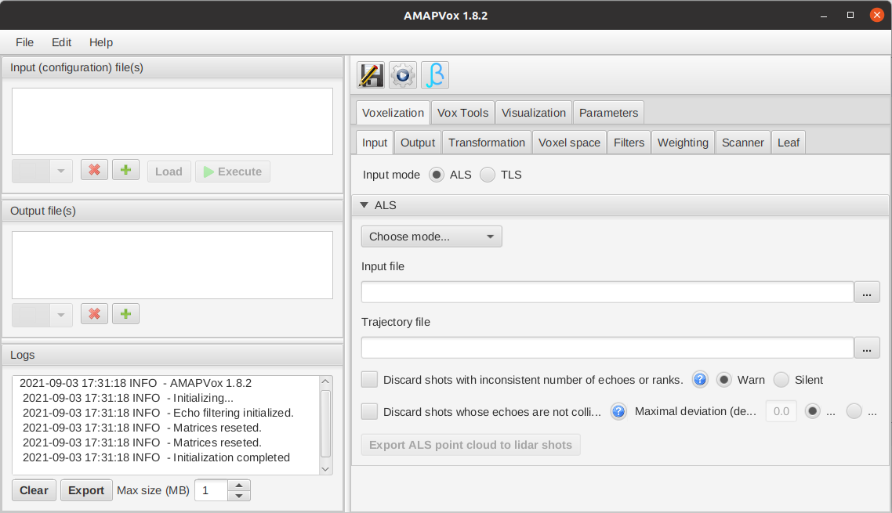

```{r, include = FALSE}
knitr::opts_chunk$set(
  collapse = TRUE,
  comment = "#>"
)
```

<!-- AMAPVox logo -->
<center></center>

```{r setup}
library(AMAPVox)
```
# System requirements

**Operating system**: Windows (7 or above), Linux-based, Mac OS X. 64-Bit.

**Java**: Java 1.8 64-Bit with JavaFX. In practice either \href{https://java.com/download/}{Java 1.8 64-Bit Oracle} or \href{https://aws.amazon.com/fr/corretto/}{Java 1.8 64-Bit Corretto}.

**CPU**: one required but multi-core CPU recommended for multithreading execution.

**RAM**: 1GB is enough for running the sample case. It will greatly depends on
the dimension of the voxel space and the size of the LiDAR scans.

**OpenGL**: Version 3 or higher, for visualization only.

# Installation

Install and run latest AMAPVox version (with active internet connection)
```{r eval=FALSE}
AMAPVox::gui()
```
After downloading latest version, AMAPVox GUI starts automatically:
<center>{width=640px}</center>
