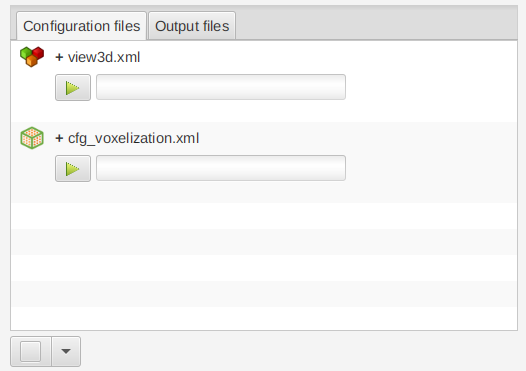
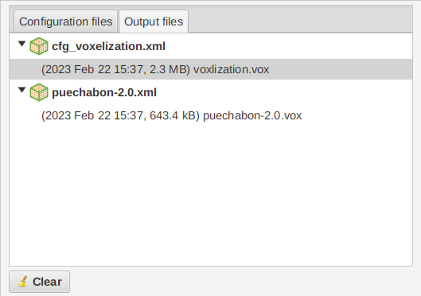

```{r, include = FALSE}
knitr::opts_chunk$set(
  collapse = TRUE,
  comment = "#>"
)
options(rmarkdown.html_vignette.check_title = FALSE)
```

```{r setup}
library(AMAPVox)
```

## Main frame

AMAPVox GUI fulfills three objectives:

1. Editing configuration conveniently;
2. Running simulations (sequentially or concurrently);
3. Visualizing quickly output files (3D views and vertical profiles)

The main toolbar and the File menu provides the usual functions New/ Open / 
Edit / Close / Save / Save as etc.

## Tabs Configurationfiles and Output files

The top left pane contains the configuration pane and the output pane.

The configuration pane lists the configurations files that have
been opened or created. Double click or right clik Edit to edit the
configuration file.

<center></center>

The output pane lists the output files grouped by configuration. You may right
click on the files to edit a context menu.

<center></center>

## Log pane

The bottom left pane contains the logs from the main frame and the processes
when there are running. You may clean the log pane, export it as a text file
and cap the size of the log in the heap memory.

## Vox tools tab pane

The vox tools frame is dedicated to the edition of the configuration files.

### New configuration

Menu > File > New or click on the New button {width=24px}
in the toolbar.

A configuration file is an XML file with following header:
<?xml version="1.0" encoding="UTF-8"?>
<configuration creation-date="Thu Sep 23 16:14:41 CEST 2021" build-version="1.8.0" update-date="Mon Sep 27 09:59:18 CEST 2021">
<process mode="process-name" >

### Open configuration

Menu > File > Open or click on the Open button {width=24px}
in the toolbar.
The configuration file is added in the configuration pane but is not edited 
automatically. The Start button {width=24px} is
disable if the file that has never been edited yet.

### Edit configuration

Select one or more files in the configuration pane then
Menu > File > Edit or click on the Save button {width=24px}
in the toolbar.

You may also:

- double click on a file in the configuration pane;
- right-click on a file in the configuration pane to display the context
menu and click on Edit;

Then you may modify the parameters. Use the Help
buttons {width=24px} throughout the configuration editor
as much as you can. Many parameters provide on-the-fly validation, for instance
some text fields only accept numerical values.

### Save configuration

Select one or more modified files in the configuration pane then
Menu > File > Save or click on the Save button {width=24px}
in the toolbar.

As soon as a parameter is modified in the configuration editor the name of the
configuration will appear in bold with a leading *. It reminds you to save the
configuration file. If you were to run a modified configuration file, it would
be saved beforehand automatically.

Before saving some configuration editors may launch a validity check and
provide some feedback. File will not be saved until you address all the issues 
detected by the validity check. You may notice that in the meantime
the {width=24px} is disable.

### Close configuration

Select one or more files in the configuration pane then
Menu > File > Close or click on the Close button {width=24px}
in the toolbar.

A dialog box will show up if you attempt to close a modified file, to ask for
confirmation. Same when you exit the program.

Closing the configuration tab in the Vox tools tab pane only hides the editor.
Unsaved modifications are kept. A configuration file is only closed when it is
removed from the configuration pane.


